# JustVue

JustVue is a modern, secure snippet manager designed to store your code snippets, images, and PDF documents with ease. Built with performance and security in mind, it leverages Supabase for real-time synchronization and cloud storage, ensuring your data is accessible and up-to-date across all your devices.

## Features

- **📝 Multi-Format Support**  
  Store more than just code. JustVue supports:
  - Text & Code Snippets
  - Images (Direct upload to Supabase Storage)
  - PDF Documents

- **🔒 Security & Privacy**
  - **Password Protection**: Secure individual snippets with a password.
  - **Encryption**: Content can be encrypted server-side (AES-256-GCM) before storage.
  - **Hide Content**: Toggle visibility of sensitive snippets.

- **☁️ Cloud Sync & Real-Time Updates**
  - Powered by **Supabase**.
  - **Live Sync**: Changes defined on one device appear instantly on others.
  - **Auto-Update**: The UI refreshes automatically when new data is available.

- **🎨 Modern UI/UX**
  - Clean, responsive design.
  - **Dark Mode**: Automatic theme detection with adaptive favicon.
  - **Search**: Instant client-side filtering by title or content.

## How It Works

```mermaid
flowchart TD
    User["👤 User"] -->|Interacts| UI["💻 JustVue Web UI"]
    
    subgraph Frontend ["Frontend Layer"]
        UI
        Logic["App Logic / State"]
    end
    
    subgraph Backend ["Serverless Layer - Netlify"]
        Config["⚙️ config"]
        Crypto["🔐 crypto"]
        Save["💾 save-data"]
        Get["🔍 get-data"]
    end
    
    subgraph Database ["Supabase Services"]
        DB[("🗄️ Database")]
        Storage["📂 Storage Bucket"]
    end
    
    UI -->|Init| Config
    UI -->|Input| Logic
    
    Logic -->|Save Text OR Hidden Content| Save
    Logic -->|Upload Public Files| Storage
    Logic -->|Save File Metadata| Save
    
    Logic -->|Encrypt/Decrypt Data| Crypto
    
    Save -->|Persist| DB
    Get -->|Query| DB
    
    Logic -->|Load Data| Get
    Get -.->|JSON| Logic
```



## Tech Stack

- **Frontend**: HTML5, CSS3, Vanilla JavaScript
- **Backend**: Supabase (PostgreSQL, Storage)
- **Serverless**: Netlify Functions (Node.js)

## Installation & Setup

### Prerequisites

1.  **Node.js** & **npm** installed.
2.  A [Supabase](https://supabase.com/) account and project.
3.  A [Netlify](https://www.netlify.com/) account (recommended for deployment).

### 1. Clone the Repository

```bash
git clone https://github.com/Surventurer/JustVue.git
cd JustVue
```

### 2. Supabase Configuration

1.  Go to your Supabase project dashboard.
2.  **Database**: opens the SQL Editor and run the script found in `database-schema.sql` to create the necessary tables and indexes.
3.  **Storage**: Create a new storage bucket named `code-files`.
    *   Set it to **Public** if you want direct URL access.
    *   Or keep it **Private** (recommended) for use with signed URLs.

### 3. Environment Variables

If deploying to Netlify, set the following environment variables in your Site Settings:

- `SUPABASE_URL`: Your Supabase Project URL.
- `SUPABASE_ANON_KEY`: Your Supabase **public** `anon` key.
- `SUPABASE_SERVICE_KEY`: Your Supabase **secret** `service_role` key (required for server-side functions).

### 4. Local Development

To run the project locally with serverless functions support, use Netlify CLI:

```bash
# Install Netlify CLI globally
npm install -g netlify-cli

# Start the development server
netlify dev
```

This will start a local server (usually at `http://localhost:8888`) that mimics the production environment, including function execution.

## Usage

1.  **Add a Snippet**:
    *   Enter a **Title** and **Password**.
    *   Select Type: Text, Image, or PDF.
    *   Paste your code/text or select a file.
    *   (Optional) Check "Hide This Content" to encrypt it.
    *   Click **Add Snippet**.

2.  **View & Decrypt**:
    *   Hidden snippets require a password to view or download.
    *   Click "Copy" or "Download" and enter the password when prompted.

3.  **Search**: Use the search bar to filter snippets by title.

## License

This project is licensed under the [Apache-2.0 License](LICENSE).
